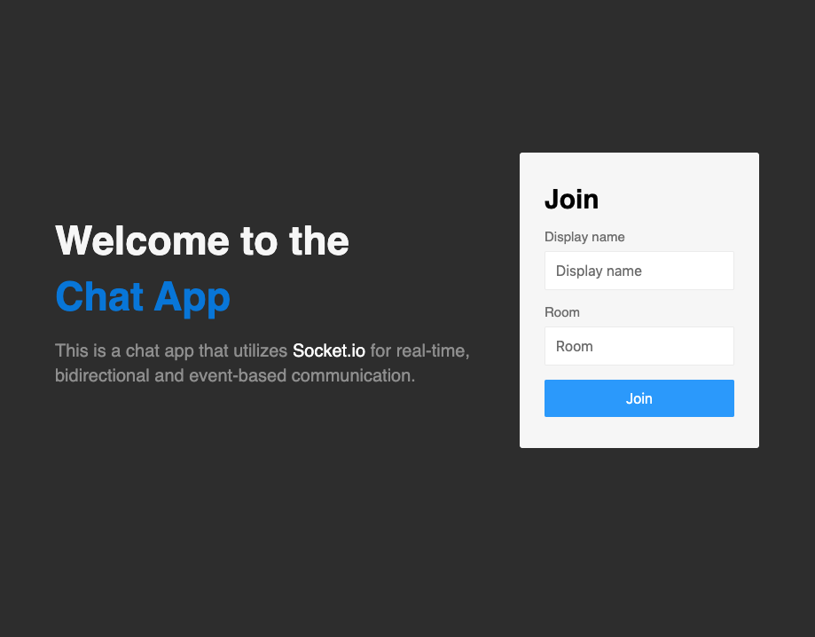

# Chat-App

[Visit Live Site](https://womack117-chat-app.herokuapp.com)

## A real-time Node.Js chat application that utilizes Socket.io

Users can join chat rooms and send messages to each other and share their location with almost no delay. Messages will only be seen by others in the same chat room.

## Technologies

This project was created with:

- **Node.Js** -
- **Express**
- **Socket.io**
- **Moment.js**

